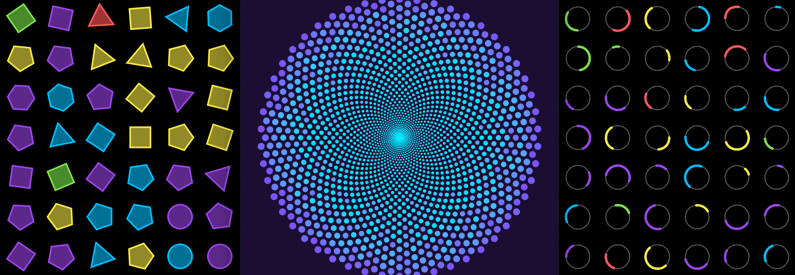

# Processing SVG experiments

I’ve been experimenting with creating SVGs programmatically, which opens up a world of possibilities. It allows patterns, shapes, and compositions that would not be easy or possible by hand. The results can then be imported into Illustrator, Sketch or your design tool of choice, augmenting their features.

For more information, please take a look at this project’s companion article: [Creating SVGs using Processing](https://bjango.com/articles/processingsvg/)

**Download:** **[Processing SVG experiments](https://github.com/bjango/Processing-SVG-experiments/archive/master.zip)**

-----

This project is free and open source, released under the [BSD license](https://github.com/bjango/Processing-SVG-experiments/blob/master/Help/License.md).

Short questions about this project can be sent to [@marcedwards](https://twitter.com/marcedwards) or [@bjango](https://twitter.com/bjango) on Twitter. More verbose questions can be sent via the [Bjango contact page](https://bjango.com/contact/). If you notice any errors, please let me know.

-----

```
              :::::::::     :::::::       ::::        ::::    :::     ::::::::      :::::::: 
             :+:    :+:        :+:      :+: :+:      :+:+:   :+:    :+:    :+:    :+:    :+: 
            +:+    +:+        +:+     +:+   +:+     :+:+:+  +:+    +:+           +:+    +:+  
           +#++:++#+         +#+    +#++:++#++:    +#+ +:+ +#+    :#:           +#+    +:+   
          +#+    +#+        +#+    +#+     +#+    +#+  +#+#+#    +#+   +#+#    +#+    +#+    
         #+#    #+#    #+# #+#    #+#     #+#    #+#   #+#+#    #+#    #+#    #+#    #+#     
        #########      #####     ###     ###    ###    ####     ########      ######## 
```
